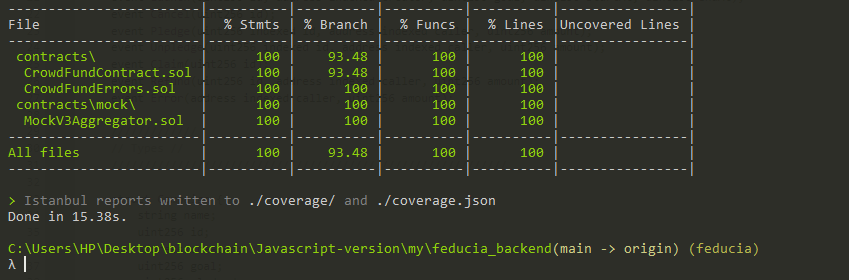
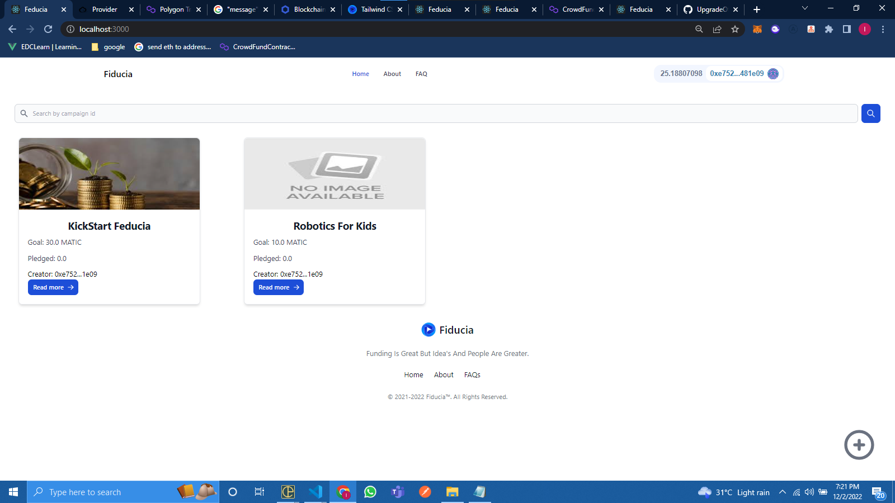

<div id="top"></div>

[![Contributors][contributors-shield]][contributors-url]
[![MIT License][license-shield]][license-url]
[![LinkedIn][linkedin-shield]][linkedin-url]

<!-- PROJECT LOGO -->
<br />
<div align="center">
  <a href="https://github.com/UpgradeOfficial/feducia">
    
  </a>
  <a href="https://github.com/UpgradeOfficial/feducia">
    
  </a>

  <h3 align="center">Feducia</h3>

  <p align="center">
    A CROWDFUNDING DAPP FOR SIMPLICITY
    <br />
    <a href="https://github.com/UpgradeOfficial/feducia"><strong>Explore the docs »</strong></a>
    <br />
    <br />
    <a href="https://feducia.vercel.app/">View Demo</a>
    ·
    <a href="https://github.com/UpgradeOfficial/feducia/issues">Report Bug</a>
    ·
    <a href="https://github.com/UpgradeOfficial/feducia/issues">Request Feature</a>
  </p>
</div>

<!-- TABLE OF CONTENTS -->
<details>
  <summary>Table of Contents</summary>
  <ol>
    <li>
      <a href="#about-the-project">About The Project</a>
      <ul>
        <li><a href="#built-with">Built With</a></li>
      </ul>
    </li>
    <li>
      <a href="#getting-started">Getting Started</a>
      <ul>
        <li><a href="#prerequisites">Prerequisites</a></li>
        <li><a href="#installation">Installation</a></li>
      </ul>
    </li>
    <li><a href="#usage">Usage</a></li>
    <li><a href="#roadmap">Roadmap</a></li>
    <li><a href="#contributing">Contributing</a></li>
    <li><a href="#license">License</a></li>
    <li><a href="#contact">Contact</a></li>
    <li><a href="#acknowledgments">Acknowledgments</a></li>
  </ol>
</details>

<!-- ABOUT THE PROJECT -->

## About The Project

[![Product Name Screen Shot][product-screenshot]](https://feducia.vercel.app/)

This is an open source project on building a CrowdFunding DAPP. Open source is very important and I am happy to support anything open source. I also created this project as part of the requirement of the Polygon Hackathon. The reason why this project is very meaningful and sparked something in me are:


- IT A GOOD WAY TO TEST PUBLIC ACCEPTANCE OF AN IDEA
- IT TRANSPARENT
- IT CAN BE A FAST WAY TO RAISE MONEY
- IT IS SECURED AND NO NEED FOR TRUST (TRUSTLESS)
- IT CAN KEEP THE ANONYMITY OF THE CAMPAIGNER
- IT IS SECURED(YOUR FUNDS CAN'T BE SEIZED)
- IT CAN BE A WAY TO LOCK MONEY FOR A SPECIFIC TIME PERIOD
- LEARNING AND IMPROVING MY BLOCKCHAIN SKILLS

Of course, no one single project  will serve all case since your needs may be different. So I'll be adding more in the near future(and your help will be greatly appreciated). You may also suggest changes by forking this repo and creating a pull request or opening an issue. Thanks to all the people who will contributed to expanding this Project!


<p align="right">(<a href="#top">back to top</a>)</p>

### Built With

This project was built with the following technologies( as of the time of the last update of this readme file and in no order of importance).

- [Solidity](https://docs.soliditylang.org/en/v0.8.17/)
- [Hardhat](https://hardhat.org/)
- [Polygon](https://polygon.technology/)
- [Javascript](https://developer.mozilla.org/en-US/docs/Web/JavaScript)
- [Firebase](https://firebase.google.com/docs)
- [Chainlink](https://docs.chain.link/)


<p align="right">(<a href="#top">back to top</a>)</p>

<!-- GETTING STARTED -->

## Getting Started

Below is how to get started with this project.
<div>
## Requirements

See the requirements for this project [click here](https://github.com/UpgradeOfficial/feducia/blob/main/requirements.txt).

## Installation

- First clone the project into your local machine.

```bash
git clone https://github.com/UpgradeOfficial/feducia.git
```

- Go to the repository.

```bash
cd feducia
```

- install dependencies.

```bash
yarn install
```

- Copy the `example.env` file to `.env` and fill in the values.

```bash
cp example.env .env
```

- The `.env` file should look like this:

```text
PRIVATE_KEY=your_private_key
MUMBAI_RPC_URL=your_mumbai_rpc-_url
GOERLI_RPC_URL=your_goerli_rpc-_url
ETHERSCAN_API_KEY=your_etherscan_api_key
UPDATE_FRONT_END=<true/false>
```

- Deploy to network e.g localhost, mumbai, goerli e.t.c

```bash
yarn hardhat deploy --network <name_of_network>
```
- Test the Dapp which has a test coverage of more than 95%

```bash
yarn hardhat test --network <name_of_network>
```

## Interact with the contract

- Create a campaign:

```bash
 yarn hardhat launch --goal 100 --start-at 1668455498 --end-at 1668460778 --network <name_of_network>
```

- Get campaign information

```bash
  yarn hardhat getCampaign --id 1 --network <name_of_network>
```

Note: Other functions/task can be seen in the tasks Folder of the contract
</div>


<p align="right">(<a href="#top">back to top</a>)</p>

<!-- USAGE EXAMPLES -->

## Usage

This app can be used and intaract in various ways 
- It can be used via <a href="https://mumbai.polygonscan.com/address/0x57504F6E94B82FC9035778a0cbd71BeE59B9DF95#code">etherscan</a>
- It can be used via the <a href="https://feducia.vercel.app/">react app</a>
- Download the project and run the tasks to interact with contract

<p align="right">(<a href="#top">back to top</a>)</p>

<!-- ROADMAP -->

## Roadmap

- [x] Think the Hackathon Idea
- [x] Create the contract
- [x] Test The Contract
- [x] Create Task to interact with the contract
- [x] Deploy the contract
- [x] Creat a frontend for the contract
  

See the [open issues](https://github.com/UpgradeOfficial/feducia/issues) for a full list of proposed features (and known issues).

<p align="right">(<a href="#top">back to top</a>)</p>

<!-- CONTRIBUTING -->

## Contributing

Contributions are what make the open source community such an amazing place to learn, inspire, and create. Any contributions you make are **greatly appreciated**.

If you have a suggestion that would make this better, please fork the repo and create a pull request. You can also simply open an issue with the tag "enhancement".
Don't forget to give the project a star! Thanks again!

1. Fork the Project
2. Create your Feature Branch (`git checkout -b feature/AmazingFeature`)
3. Commit your Changes (`git commit -m 'Add some AmazingFeature'`)
4. Push to the Branch (`git push origin feature/AmazingFeature`)
5. Open a Pull Request

<p align="right">(<a href="#top">back to top</a>)</p>

<!-- LICENSE -->

## License

Distributed under the MIT License. See `LICENSE.txt` for more information.

<p align="right">(<a href="#top">back to top</a>)</p>

<!-- CONTACT -->

## Contact

- twitter - [@IncreaseOdeyemi](https://twitter.com/IncreaseOdeyemi) 
- email - odeyemiincrease@yahoo.com 
- phone no. - 07068448786 (whatsapp)
- Project Link: [https://github.com/UpgradeOfficial/feducia](https://github.com/UpgradeOfficial/feducia)

<p align="right">(<a href="#top">back to top</a>)</p>

<!-- ACKNOWLEDGMENTS -->

## Acknowledgments

Special acknolegment to the following people/company/organisation:

- [Odeyemi Increase Ayobami](https://github.com/UpgradeOfficial/)
- [Polygon](https://polygon.technology/)


<p align="right">(<a href="#top">back to top</a>)</p>

<!-- MARKDOWN LINKS & IMAGES -->
<!-- https://www.markdownguide.org/basic-syntax/#reference-style-links -->

[contributors-shield]: https://img.shields.io/badge/Contributors-1-orange
[contributors-url]: https://github.com/UpgradeOfficial/feducia/graphs/contributors
[forks-shield]: https://img.shields.io/github/forks/UpgradeOfficial/feducia.svg?style=for-the-badge
[forks-url]: https://github.com/UpgradeOfficial/feducia/network/members
[stars-shield]: https://img.shields.io/github/stars/UpgradeOfficial/feducia.svg?style=for-the-badge
[stars-url]: https://github.com/UpgradeOfficial/feducia/stargazers
[issues-shield]: https://img.shields.io/github/issues/UpgradeOfficial/feducia.svg?style=for-the-badge
[issues-url]: https://github.com/UpgradeOfficial/feducia/issues
[license-shield]: https://img.shields.io/github/license/UpgradeOfficial/feducia.svg?style=for-the-badge
[license-url]: https://github.com/UpgradeOfficial/feducia/blob/master/LICENSE.txt
[linkedin-shield]: https://img.shields.io/badge/-LinkedIn-black.svg?style=for-the-badge&logo=linkedin&colorB=555
[linkedin-url]: https://www.linkedin.com/in/odeyemi-increase/
[product-screenshot]: src/assets/github/feducia_homepage.png